# Swantara Gate - Use Case Diagram

## 📋 Project Overview

**Swantara Gate** adalah API Gateway yang menyediakan fitur lengkap untuk manajemen proxy routing, security, SSL/TLS, dan konfigurasi sistem.

---

## 🎭 Actors

### 1. **Admin** (Primary Actor)
- Administrator sistem yang mengelola seluruh konfigurasi API Gateway
- Akses penuh ke semua fitur

### 2. **API Consumer** (Secondary Actor)
- Aplikasi atau pengguna yang menggunakan API melalui gateway
- Terbatas pada akses yang diberikan melalui ACL

### 3. **External Auth Provider** (Secondary Actor)
- Provider autentikasi eksternal (OAuth2, LDAP, SAML)
- Digunakan untuk verifikasi autentikasi

### 4. **ACME Provider** (Secondary Actor)
- Provider sertifikat SSL (Let's Encrypt, dll)
- Otomatisasi pembuatan dan perpanjangan sertifikat

### 5. **Service Registry** (Secondary Actor)
- Service discovery provider (Consul, etcd, dll)
- Menyediakan informasi upstream servers secara dinamis

---

## 📊 Use Case Diagram (Mermaid)

```mermaid
graph TB
    Admin[👤 Admin]
    Consumer[🔑 API Consumer]
    ExtAuth[🔐 External Auth Provider]
    ACME[🎫 ACME Provider]
    ServiceReg[🔍 Service Registry]
    
    subgraph Dashboard
        UC1[View Dashboard Statistics]
    end
    
    subgraph Proxy_Config[Proxy Configuration]
        UC2[Manage Hosts]
        UC3[Manage Virtual Hosts]
        UC4[Manage Upstream Servers]
        UC5[Manage Virtual Directories]
        UC6[Configure Service Discovery]
    end
    
    subgraph Security[Security Management]
        UC7[Manage API Consumers]
        UC8[Manage API Keys]
        UC9[Manage Consumer Credentials]
        UC10[Configure JWT Authentication]
        UC11[Configure External Authentication]
        UC12[Manage Route Access ACL]
        UC13[Manage IP Whitelists]
        UC14[Manage IP Blacklists]
    end
    
    subgraph Advanced[Advanced Configuration]
        UC15[Configure Rate Limits]
        UC16[Configure Circuit Breakers]
        UC17[Configure CORS]
        UC18[Manage Request Headers]
        UC19[Manage Response Headers]
        UC20[Configure Query Rewrites]
    end
    
    subgraph SSL_TLS[SSL/TLS Management]
        UC21[Manage SSL Certificates]
        UC22[Manage Certificate Domains]
        UC23[Configure SSL Bindings]
        UC24[Configure TLS Options]
        UC25[Manage ACME Accounts]
    end
    
    subgraph System[System Management]
        UC26[Manage Users]
        UC27[Configure Maintenance Windows]
        UC28[View Config History]
        UC29[Reload Configuration]
    end
    
    Admin --> UC1
    Admin --> UC2
    Admin --> UC3
    Admin --> UC4
    Admin --> UC5
    Admin --> UC6
    Admin --> UC7
    Admin --> UC8
    Admin --> UC9
    Admin --> UC10
    Admin --> UC11
    Admin --> UC12
    Admin --> UC13
    Admin --> UC14
    Admin --> UC15
    Admin --> UC16
    Admin --> UC17
    Admin --> UC18
    Admin --> UC19
    Admin --> UC20
    Admin --> UC21
    Admin --> UC22
    Admin --> UC23
    Admin --> UC24
    Admin --> UC25
    Admin --> UC26
    Admin --> UC27
    Admin --> UC28
    Admin --> UC29
    
    UC6 -.->|Query| ServiceReg
    UC11 -.->|Verify| ExtAuth
    UC21 -.->|Auto Renew| ACME
    UC25 -.->|Request Certificate| ACME
    
    Consumer -.->|Access API| UC12
    Consumer -.->|Authenticate| UC10
    Consumer -.->|Authenticate| UC11
```

---

## 📝 Use Case Specifications

### **1. Dashboard**

| Use Case | View Dashboard Statistics |
|----------|--------------------------|
| **Actor** | Admin |
| **Description** | Melihat statistik dan monitoring API Gateway |
| **Preconditions** | Admin sudah login |
| **Main Flow** | 1. Admin membuka dashboard 2. Sistem menampilkan statistik hosts, routes, consumers 3. Sistem menampilkan traffic dan health status |
| **Postconditions** | Admin mendapat overview sistem |

---

### **2. Proxy Configuration**

#### **UC2: Manage Hosts**

| Field | Value |
|-------|-------|
| **Actor** | Admin |
| **Description** | CRUD host/domain untuk API Gateway |
| **Main Flow** | 1. Admin memilih menu Hosts 2. Admin melakukan Create/Read/Update/Delete host 3. Sistem memvalidasi host name 4. Sistem menyimpan konfigurasi |
| **Includes** | Validate Host Name, Check DNS Resolution |

#### **UC3: Manage Virtual Hosts**

| Field | Value |
|-------|-------|
| **Actor** | Admin |
| **Description** | Konfigurasi virtual host dengan load balancing |
| **Main Flow** | 1. Admin memilih host 2. Admin membuat virtual host 3. Admin mengatur LB algorithm (round-robin, weighted, least-conn) 4. Admin configure sticky session & failover |
| **Includes** | Configure Load Balancing, Setup Failover |

#### **UC4: Manage Upstream Servers**

| Field | Value |
|-------|-------|
| **Actor** | Admin |
| **Description** | CRUD upstream backend servers |
| **Main Flow** | 1. Admin memilih virtual host 2. Admin menambah upstream server 3. Admin configure health check 4. Sistem memvalidasi connectivity |
| **Includes** | Health Check Configuration, Connectivity Test |

#### **UC5: Manage Virtual Directories**

| Field | Value |
|-------|-------|
| **Actor** | Admin |
| **Description** | Konfigurasi routing paths (routes) |
| **Main Flow** | 1. Admin memilih virtual host 2. Admin membuat route dengan source path 3. Admin configure match type (prefix, exact, rewrite) 4. Admin set proxy timeout, retry, cache |
| **Includes** | Configure Match Type, Set Proxy Timeout, Configure HTTP Methods |

#### **UC6: Configure Service Discovery**

| Field | Value |
|-------|-------|
| **Actor** | Admin, Service Registry |
| **Description** | Auto-discovery upstream servers dari service registry |
| **Main Flow** | 1. Admin enable service discovery 2. Admin configure provider (Consul, etcd) 3. Sistem query service registry secara periodic 4. Sistem auto-update upstream servers |
| **Includes** | Auto-Update Upstreams, Health Monitoring |

---

### **3. Security Management**

#### **UC7-9: Manage API Consumers & Credentials**

| Field | Value |
|-------|-------|
| **Actor** | Admin |
| **Description** | CRUD consumer applications dan credentials |
| **Main Flow** | 1. Admin membuat consumer application 2. Admin generate API key atau credentials 3. Admin assign ke routes tertentu 4. Consumer menggunakan credentials untuk akses API |
| **Includes** | Generate API Key, Create Basic Auth, Create OAuth2 Client |

#### **UC10: Configure JWT Authentication**

| Field | Value |
|-------|-------|
| **Actor** | Admin |
| **Description** | Setup JWT validation untuk routes |
| **Main Flow** | 1. Admin memilih route 2. Admin configure JWT secret & algorithm 3. Admin set issuer, audience, expiration 4. Sistem validasi JWT tokens |
| **Includes** | Validate JWT Token, Check Expiration, Verify Signature |

#### **UC11: Configure External Authentication**

| Field | Value |
|-------|-------|
| **Actor** | Admin, External Auth Provider |
| **Description** | Setup external auth (OAuth2, LDAP, SAML) |
| **Main Flow** | 1. Admin configure auth provider 2. Admin set auth endpoints 3. Sistem forward auth requests ke provider 4. Provider verify credentials |
| **Includes** | OAuth2 Flow, LDAP Bind, SAML Assertion |

#### **UC12-14: Access Control**

| Field | Value |
|-------|-------|
| **Actor** | Admin, API Consumer |
| **Description** | Manage route access dan IP filtering |
| **Main Flow** | 1. Admin assign consumers ke routes (ACL) 2. Admin configure IP whitelists/blacklists 3. Sistem check access pada setiap request 4. Sistem block/allow berdasarkan IP |
| **Includes** | Check ACL, Validate IP, Block Suspicious IPs |

---

### **4. Advanced Configuration**

#### **UC15: Configure Rate Limits**

| Field | Value |
|-------|-------|
| **Actor** | Admin |
| **Description** | Limit request rate per IP/consumer |
| **Main Flow** | 1. Admin set requests per minute 2. Admin configure burst size 3. Admin set block duration 4. Sistem enforce rate limits |
| **Includes** | Token Bucket Algorithm, Burst Handling |

#### **UC16: Configure Circuit Breakers**

| Field | Value |
|-------|-------|
| **Actor** | Admin |
| **Description** | Protect upstream dari cascading failures |
| **Main Flow** | 1. Admin set failure threshold 2. Admin configure recovery timeout 3. Sistem monitor failure rate 4. Sistem open/half-open/close circuit |
| **Includes** | Monitor Failures, Circuit State Management |

#### **UC17: Configure CORS**

| Field | Value |
|-------|-------|
| **Actor** | Admin |
| **Description** | Setup Cross-Origin Resource Sharing |
| **Main Flow** | 1. Admin set allowed origins 2. Admin configure allowed methods & headers 3. Admin enable credentials if needed 4. Sistem inject CORS headers |
| **Includes** | Preflight Handling, Header Injection |

#### **UC18-19: Manage Header Rules**

| Field | Value |
|-------|-------|
| **Actor** | Admin |
| **Description** | Transform request/response headers |
| **Main Flow** | 1. Admin create header rule 2. Admin set operation (set, add, remove, rename) 3. Admin configure value source 4. Sistem apply rules pada proxy |
| **Includes** | Header Transformation, Variable Substitution |

#### **UC20: Configure Query Rewrites**

| Field | Value |
|-------|-------|
| **Actor** | Admin |
| **Description** | Modify query parameters |
| **Main Flow** | 1. Admin create query rewrite rule 2. Admin set parameter name & value 3. Admin set operation (set, add, remove) 4. Sistem rewrite query strings |
| **Includes** | Query Parameter Transformation |

---

### **5. SSL/TLS Management**

#### **UC21-22: Manage SSL Certificates & Domains**

| Field | Value |
|-------|-------|
| **Actor** | Admin, ACME Provider |
| **Description** | Setup SSL certificates untuk domains |
| **Main Flow** | 1. Admin upload atau request certificate 2. Admin assign domains ke certificate 3. Sistem configure HTTPS 4. ACME auto-renew jika enabled |
| **Includes** | Certificate Validation, Auto-Renewal |

#### **UC23: Configure SSL Bindings**

| Field | Value |
|-------|-------|
| **Actor** | Admin |
| **Description** | Bind certificates ke hosts/virtual hosts |
| **Main Flow** | 1. Admin pilih certificate 2. Admin bind ke host atau virtual host 3. Admin set priority 4. Sistem apply SSL binding |
| **Includes** | SNI Configuration, Certificate Selection |

#### **UC24: Configure TLS Options**

| Field | Value |
|-------|-------|
| **Actor** | Admin |
| **Description** | Configure TLS versions dan security options |
| **Main Flow** | 1. Admin set minimum TLS version 2. Admin enable HTTP/2 3. Admin configure HSTS 4. Sistem enforce TLS policies |
| **Includes** | Protocol Version Check, HSTS Header |

#### **UC25: Manage ACME Accounts**

| Field | Value |
|-------|-------|
| **Actor** | Admin, ACME Provider |
| **Description** | Setup ACME accounts untuk auto SSL |
| **Main Flow** | 1. Admin create ACME account 2. Admin configure provider URL 3. Admin set email untuk notifications 4. Sistem request certificates otomatis |
| **Includes** | ACME Challenge, Certificate Request |

---

### **6. System Management**

#### **UC26: Manage Users**

| Field | Value |
|-------|-------|
| **Actor** | Admin |
| **Description** | CRUD admin users dengan roles |
| **Main Flow** | 1. Admin create user dengan role 2. Admin set permissions 3. Admin activate/deactivate user 4. Sistem enforce role-based access |
| **Includes** | Role Assignment, Password Hashing |

#### **UC27: Configure Maintenance Windows**

| Field | Value |
|-------|-------|
| **Actor** | Admin |
| **Description** | Schedule maintenance periods |
| **Main Flow** | 1. Admin create maintenance window 2. Admin set start/end time 3. Admin configure custom response 4. Sistem return maintenance response during window |
| **Includes** | Time Validation, Custom Response |

#### **UC28: View Config History**

| Field | Value |
|-------|-------|
| **Actor** | Admin |
| **Description** | View dan rollback konfigurasi |
| **Main Flow** | 1. Admin view config versions 2. Admin lihat perubahan per version 3. Admin rollback ke version tertentu 4. Sistem apply old configuration |
| **Includes** | Version Tracking, Configuration Diff |

#### **UC29: Reload Configuration**

| Field | Value |
|-------|-------|
| **Actor** | Admin |
| **Description** | Reload semua konfigurasi dari database |
| **Main Flow** | 1. Admin klik Reload Config 2. Sistem load semua konfigurasi 3. Sistem apply tanpa restart 4. Sistem confirm reload success |
| **Includes** | Config Validation, Zero-Downtime Reload |

---

## 🔗 Use Case Relationships

### **Include Relationships**

| Base Use Case | Included Use Case |
|---------------|-------------------|
| Manage Virtual Hosts | Configure Load Balancing |
| Manage Upstream Servers | Health Check Configuration |
| Configure JWT Authentication | Validate JWT Token |
| Configure External Authentication | OAuth2 Flow / LDAP Bind |
| Manage SSL Certificates | Certificate Validation |
| Configure Service Discovery | Auto-Update Upstreams |

### **Extend Relationships**

| Base Use Case | Extension | Condition |
|---------------|-----------|-----------|
| Manage SSL Certificates | Auto-Renewal | If auto_renew = true |
| Manage API Keys | Rate Limit Override | If custom rate limit needed |
| Configure Circuit Breakers | Alert Notification | If failures detected |
| View Config History | Rollback Configuration | If admin chooses to rollback |

---

## 📊 Use Case Statistics

| Category | Count |
|----------|-------|
| **Total Actors** | 5 |
| **Total Use Cases** | 29 |
| **Primary Actor** | Admin (29 use cases) |
| **Secondary Actors** | 4 |
| **Include Relationships** | 6+ |
| **Extend Relationships** | 4+ |

---

## 🎯 Key Business Rules

1. **Authentication Required**: Semua use cases kecuali Health Check memerlukan autentikasi
2. **Role-Based Access**: Admin role menentukan akses ke use cases tertentu
3. **Validation**: Semua konfigurasi divalidasi sebelum disimpan
4. **Zero Downtime**: Reload configuration tidak menyebabkan downtime
5. **Auto-Scaling**: Service discovery otomatis update upstream servers
6. **Security First**: IP blacklists dan rate limits enforced pada setiap request
7. **Audit Trail**: Semua perubahan konfigurasi tercatat di config history

---

## 📌 Notes

- Use case diagram ini berdasarkan **sidebar navigation** yang ada di `sidebar.html`
- Semua use cases sesuai dengan **Postman collection** endpoints (24 resource groups)
- Diagram menggunakan **Mermaid.js** untuk visualisasi
- Setiap use case memiliki **CRUD operations** (Create, Read, Update, Delete) kecuali monitoring features

---

**Document Version:** 1.0  
**Last Updated:** 2026-06-04  
**Author:** Swantara Gate Development Team
